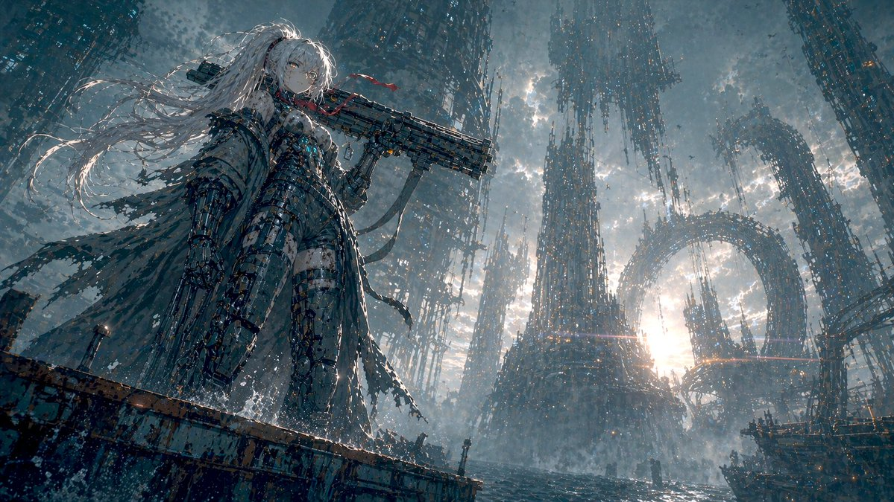

# Character Design Cases

Primary fit: 2d-anime or stylized 3d. Add character role, costume, and sheet-layout tags before queue export.

| Case | Title | Author | Prompt doc | Result |
| ---: | --- | --- | --- | --- |
| 1 | Anime Snapshot Conversion | [@Thereallo1026](https://x.com/Thereallo1026) | [case-01-anime-snapshot-conversion](./case-01-anime-snapshot-conversion/README.md) |  |
| 2 | Persona5 Character Reference Card | [@iamrednightS](https://x.com/iamrednightS) | [case-02-persona5-character-reference-card](./case-02-persona5-character-reference-card/README.md) |  |
| 3 | Gal Game Character Introduction Page | [@09lyco](https://x.com/09lyco) | [case-03-gal-game-character-introduction-page](./case-03-gal-game-character-introduction-page/README.md) |  |
| 5 | Official Character Sheet (JP) | [@Toshi_nyaruo_AI](https://x.com/Toshi_nyaruo_AI) | [case-05-official-character-sheet-jp](./case-05-official-character-sheet-jp/README.md) |  |
| 7 | Mecha Girl Sea-City Key Visual | [@old_pgmrs_will](https://x.com/old_pgmrs_will) | [case-07-mecha-girl-sea-city-key-visual](./case-07-mecha-girl-sea-city-key-visual/README.md) |  |
| 8 | Saint Seiya Gold Saints Card Grid | [@songguoxiansen](https://x.com/songguoxiansen) | [case-08-saint-seiya-gold-saints-card-grid](./case-08-saint-seiya-gold-saints-card-grid/README.md) |  |
| 9 | Chaos Notes Hidden Face Character Art | [@loglogrog](https://x.com/loglogrog) | [case-09-chaos-notes-hidden-face-character-art](./case-09-chaos-notes-hidden-face-character-art/README.md) |  |
