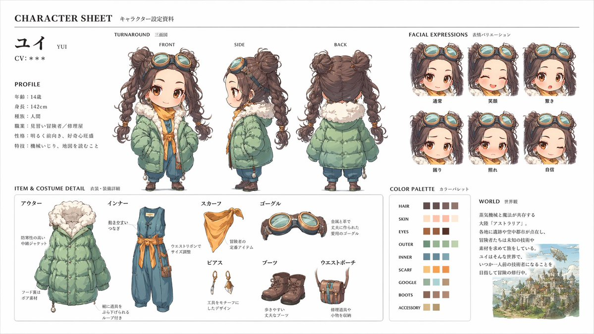

# Official Character Sheet (JP)

## Source

- Section: Character Design Cases
- Case: 5
- Author: [@Toshi_nyaruo_AI](https://x.com/Toshi_nyaruo_AI)
- Original case: [https://x.com/Toshi_nyaruo_AI/status/2045025277538107420](https://x.com/Toshi_nyaruo_AI/status/2045025277538107420)
- Source image folder: `character_case5`

## Result



## Workflow Use

- Suggested handling: Primary fit: 2d-anime or stylized 3d. Add character role, costume, and sheet-layout tags before queue export.
- Before queue export, add your own taxonomy tags such as `topCategory`, `subCategory`, `scene`, `appeal`, and `subject`.

## Prompt

```text
このキャラクターと背景を元に、 公式設定資料のようなキャラクターシートを作成してください。 
・正面、側面、背面の3面図を含める ・キャラクターの表情バリエーションを追加 
・衣装や装備の詳細パーツを分解して表示 ・カラーパレットを追加 ・世界観の簡単な説明を入れる 
・全体は整理されたレイアウト
（白背景、図解風） 
・アスペクト比16：9

高解像度、プロのコンセプトアートスタイル
```
