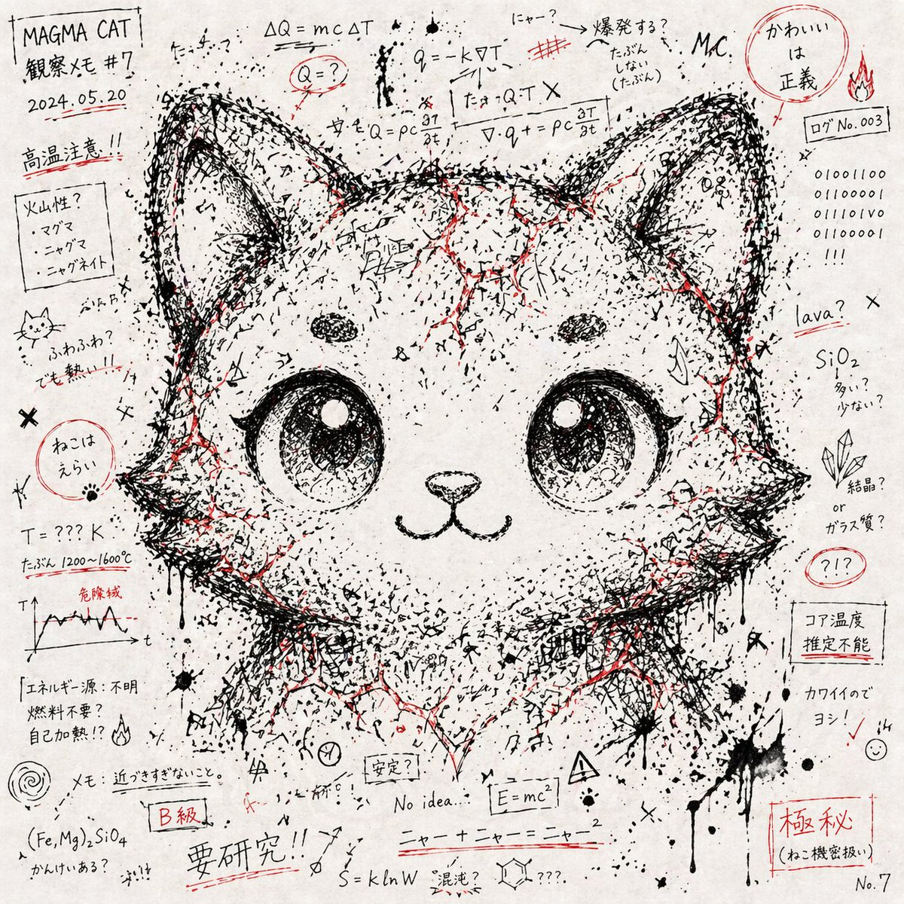

# Chaos Notes Hidden Face Character Art

## Source

- Section: Character Design Cases
- Case: 9
- Author: [@loglogrog](https://x.com/loglogrog)
- Original case: [https://x.com/loglogrog/status/2046448773162033240](https://x.com/loglogrog/status/2046448773162033240)
- Source image folder: `character_case9`

## Result



## Workflow Use

- Suggested handling: Primary fit: 2d-anime or stylized 3d. Add character role, costume, and sheet-layout tags before queue export.
- Before queue export, add your own taxonomy tags such as `topCategory`, `subCategory`, `scene`, `appeal`, and `subject`.

## Prompt

```text
# 混沌としたメモ書き・記号の集合体からキャラクターの顔を浮かび上がらせるアート

--- スタイル
- 白い紙の上に黒インクで描かれた大量の手書きメモ、数式、記号、ランダムな線。
- 紙いっぱいに散らばる書き殴り風のカオス。
- 所々に赤インクの強調(ライン、塗り潰し、マーカー風の塊)。
- アナログのノート落書きのような質感。

--- 構図
- ランダムなメモや記号が全体を覆い尽くす。
- 黒インクの線や文字の密度が「キャラクターの顔」の位置に集中する。
- 結果として、混沌の中から「与えられたキャラクターの顔のシルエット・表情」がうっすら浮かび上がる。
- 顔は写実的ではなく、カオスの断片が集まって形を成す。

--- 色彩
- モノクロ(黒・白)を主体に構成。
- 赤インクをアクセントとして散発的に配置。
- 彩度は抑えめ、アナログの紙とインク感を重視。

--- 表現要素
- 読めるようで読めない文字列、日本語や英数字が混在。
- 数式記号、矢印、点、斜線、クロス、ドリップ(インクの飛び散り)。
- キャラクターの顔の目や髪の輪郭は、メモや記号の配置の「余白」や「濃淡」で浮かび上がる。

--- 禁止事項
- 顔を直接的に描き込む写実ポートレート。
- デジタル処理的で整然とした幾何学模様。
- カラフルな彩色や過飽和表現。
- ロゴ、透かし、人工的なCG感。

--- Definition of Done (DoD)
- 全体は「混沌としたメモ・記号の集合体」として成立している。  
- 与えられたキャラクターの顔が、混沌の濃淡・配置から自然に浮かび上がる。  
- 色はモノクロ+赤アクセントのみ。  
- 紙とインクの手描き的質感を保持している。
```
