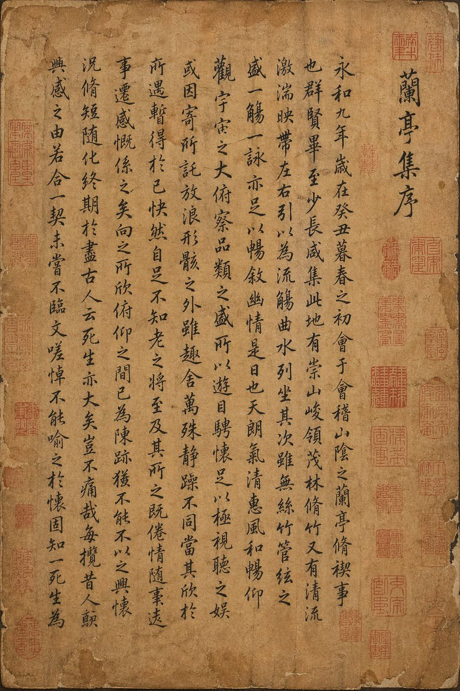
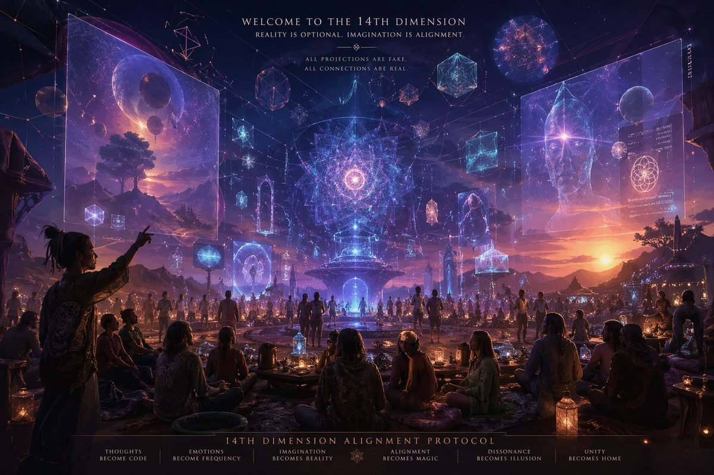

# Comparison & Community Examples

Use as experiment references, A/B tests, and benchmark cases. Add evaluation criteria before queue export.

| Case | Title | Author | Prompt doc | Result |
| ---: | --- | --- | --- | --- |
| 5 | Wooden Bookshelf Prompt Test | [@chetaslua](https://x.com/chetaslua) | [case-05-wooden-bookshelf-prompt-test](./case-05-wooden-bookshelf-prompt-test/README.md) |  |
| 10 | GPT-Image-2 Detail Showcase | [@liyue_ai](https://x.com/liyue_ai) | [case-10-gpt-image-2-detail-showcase](./case-10-gpt-image-2-detail-showcase/README.md) |  |
| 16 | A/B Test Signed Output | [@saskr_13](https://x.com/saskr_13) | [case-16-a-b-test-signed-output](./case-16-a-b-test-signed-output/README.md) |  |
| 23 | Silhouette Universe Narrative Poster | [@MrLarus](https://x.com/MrLarus) | [case-23-silhouette-universe-narrative-poster](./case-23-silhouette-universe-narrative-poster/README.md) |  |
| 29 | Lion Camel Ridge Dark Myth Scene | [@MANISH1027512](https://x.com/MANISH1027512) | [case-29-lion-camel-ridge-dark-myth-scene](./case-29-lion-camel-ridge-dark-myth-scene/README.md) |  |
| 30 | Counter-Strike x Terraria Screenshot Mashup | [@yssrski](https://x.com/yssrski) | [case-30-counter-strike-x-terraria-screenshot-mashup](./case-30-counter-strike-x-terraria-screenshot-mashup/README.md) |  |
| 31 | Pre-war Japan Lab Minecraft Screenshot | [@RitaStar1128](https://x.com/RitaStar1128) | [case-31-pre-war-japan-lab-minecraft-screenshot](./case-31-pre-war-japan-lab-minecraft-screenshot/README.md) |  |
| 32 | Forged Masterpiece Prompt Test | [@MrLarus](https://x.com/MrLarus) | [case-32-forged-masterpiece-prompt-test](./case-32-forged-masterpiece-prompt-test/README.md) |  |
| 33 | Multi-Concept Battle Poster Set | [@joshesye](https://x.com/joshesye) | [case-33-multi-concept-battle-poster-set](./case-33-multi-concept-battle-poster-set/README.md) |  |
| 34 | Rust In-Game Screenshot | [@FixlationAI](https://x.com/FixlationAI) | [case-34-rust-in-game-screenshot](./case-34-rust-in-game-screenshot/README.md) |  |
| 35 | Sam Altman Bear Selfie | [@JustinGorya](https://x.com/JustinGorya) | [case-35-sam-altman-bear-selfie](./case-35-sam-altman-bear-selfie/README.md) |  |
| 36 | Among Us Realistic Screenshot | [@ReYYYYoking](https://x.com/ReYYYYoking) | [case-36-among-us-realistic-screenshot](./case-36-among-us-realistic-screenshot/README.md) |  |
| 37 | Retro Programming Museum Cartoon | [@XiaohuiAI666](https://x.com/XiaohuiAI666) | [case-37-retro-programming-museum-cartoon](./case-37-retro-programming-museum-cartoon/README.md) |  |
| 38 | 14th-Dimension Projection Scene | [@workingclassbud](https://x.com/workingclassbud) | [case-38-14th-dimension-projection-scene](./case-38-14th-dimension-projection-scene/README.md) |  |
| 39 | Sam Altman Baseball Broadcast | [@16kthir0GRXgNqn](https://x.com/16kthir0GRXgNqn) | [case-39-sam-altman-baseball-broadcast](./case-39-sam-altman-baseball-broadcast/README.md) |  |
