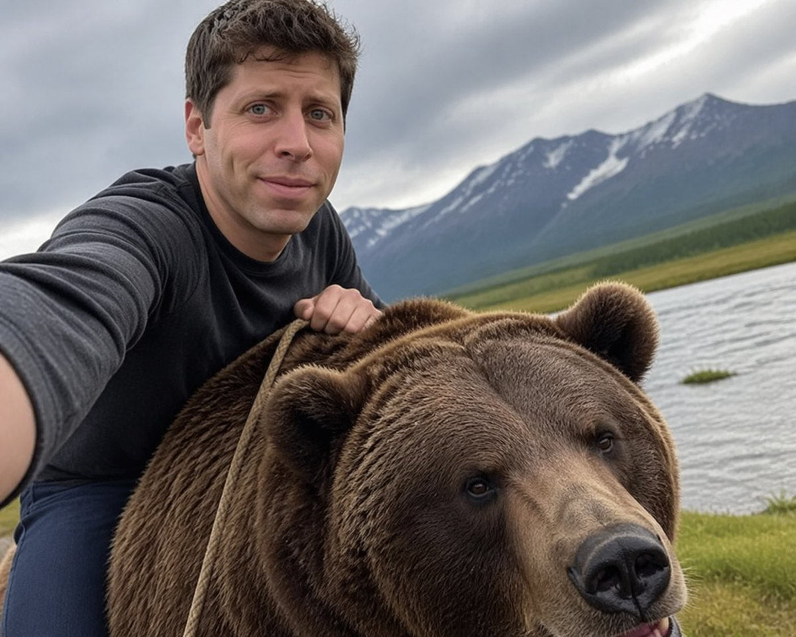

# Sam Altman Bear Selfie

## Source

- Section: Comparison & Community Examples
- Case: 35
- Author: [@JustinGorya](https://x.com/JustinGorya)
- Original case: [https://x.com/JustinGorya/status/2046510831832006970](https://x.com/JustinGorya/status/2046510831832006970)
- Source image folder: `comparison_case35`

## Result



## Workflow Use

- Suggested handling: Use as experiment references, A/B tests, and benchmark cases. Add evaluation criteria before queue export.
- Before queue export, add your own taxonomy tags such as `topCategory`, `subCategory`, `scene`, `appeal`, and `subject`.

## Prompt

```text
generate image: Selfie of Sam Altman riding a bear

Edit prompt: Remove the background make it transparent
```
