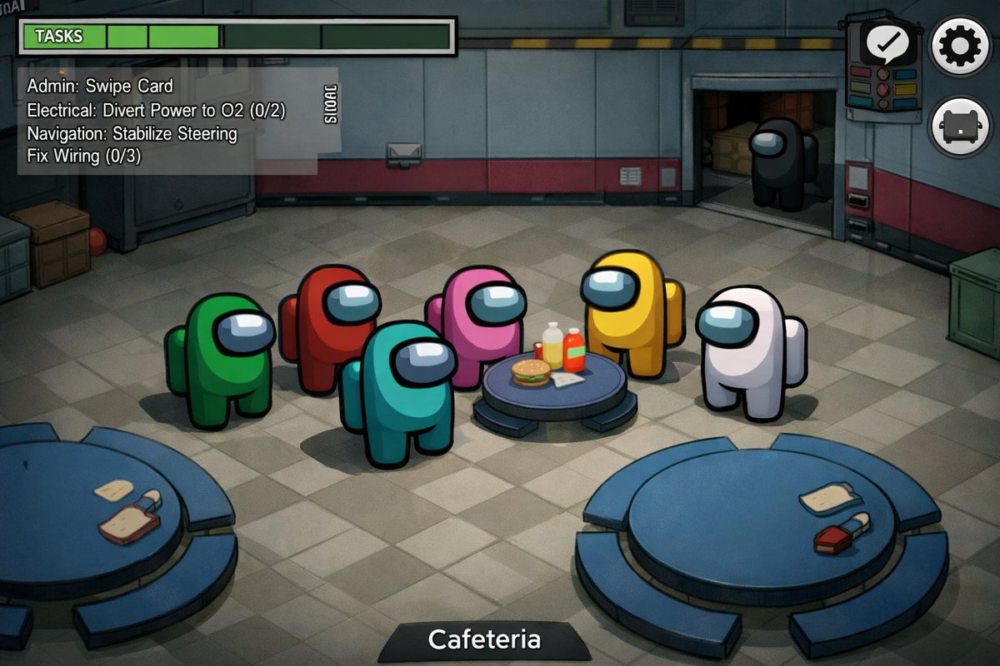

# Among Us Realistic Screenshot

## Source

- Section: Comparison & Community Examples
- Case: 36
- Author: [@ReYYYYoking](https://x.com/ReYYYYoking)
- Original case: [https://x.com/ReYYYYoking/status/2046502217843376292](https://x.com/ReYYYYoking/status/2046502217843376292)
- Source image folder: `comparison_case36`

## Result



## Workflow Use

- Suggested handling: Use as experiment references, A/B tests, and benchmark cases. Add evaluation criteria before queue export.
- Before queue export, add your own taxonomy tags such as `topCategory`, `subCategory`, `scene`, `appeal`, and `subject`.

## Prompt

```text
AmongUsの精密な実際のゲーム画像を生成して
```
