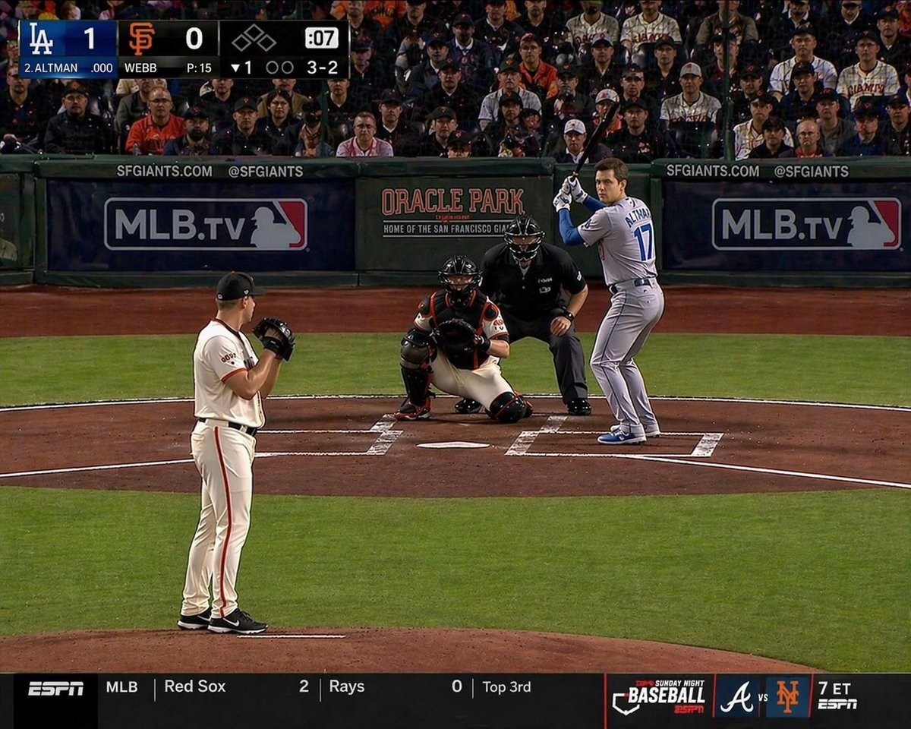

# Sam Altman Baseball Broadcast

## Source

- Section: Comparison & Community Examples
- Case: 39
- Author: [@16kthir0GRXgNqn](https://x.com/16kthir0GRXgNqn)
- Original case: [https://x.com/16kthir0GRXgNqn/status/2046507362266259832](https://x.com/16kthir0GRXgNqn/status/2046507362266259832)
- Source image folder: `comparison_case39`

## Result



## Workflow Use

- Suggested handling: Use as experiment references, A/B tests, and benchmark cases. Add evaluation criteria before queue export.
- Before queue export, add your own taxonomy tags such as `topCategory`, `subCategory`, `scene`, `appeal`, and `subject`.

## Prompt

```text
サムアルトマンがメジャーリーガーでバットを構えている。よくあるようなテレビ画面の構図
```
