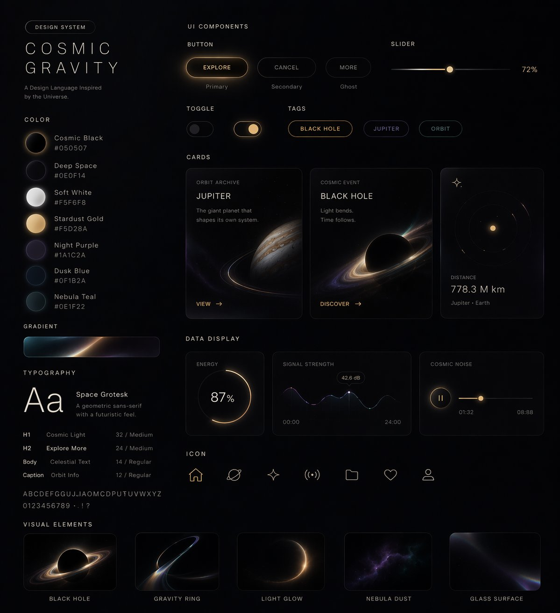

# Style-to-UI Design System

## Source

- Section: UI & Social Media Mockup Cases
- Case: 9
- Author: [@stark_nico99](https://x.com/stark_nico99)
- Original case: [https://x.com/stark_nico99/status/2045836554451706125](https://x.com/stark_nico99/status/2045836554451706125)
- Source image folder: `ui_case9`

## Result



## Workflow Use

- Suggested handling: Mixed fit: UI, infographic, mockup, and screenshot generation. Add layout and text-density tags before queue export.
- Before queue export, add your own taxonomy tags such as `topCategory`, `subCategory`, `scene`, `appeal`, and `subject`.

## Prompt

```text
用这种风格帮我生成一套UI设计系统，包含网页、移动端、卡片、控件、按钮以及其它。把这套视觉风格作为参考生成网页。我尝试了宇宙、飞行、蝴蝶主题。
```
