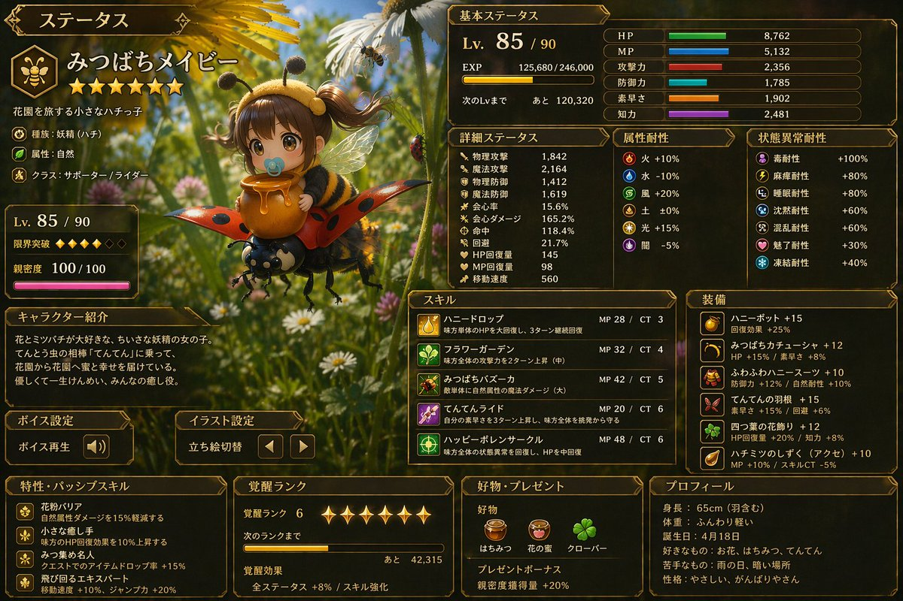

# Japanese RPG Status Screen

## Source

- Section: UI & Social Media Mockup Cases
- Case: 27
- Author: [@Kashiko_AIart](https://x.com/Kashiko_AIart)
- Original case: [https://x.com/Kashiko_AIart/status/2046154976159035613](https://x.com/Kashiko_AIart/status/2046154976159035613)
- Source image folder: `ui_case27`

## Result



## Workflow Use

- Suggested handling: Mixed fit: UI, infographic, mockup, and screenshot generation. Add layout and text-density tags before queue export.
- Before queue export, add your own taxonomy tags such as `topCategory`, `subCategory`, `scene`, `appeal`, and `subject`.

## Prompt

```text
この画像からゲームのステータス画面を作ってください。情報量多め。言語は日本語。
```
