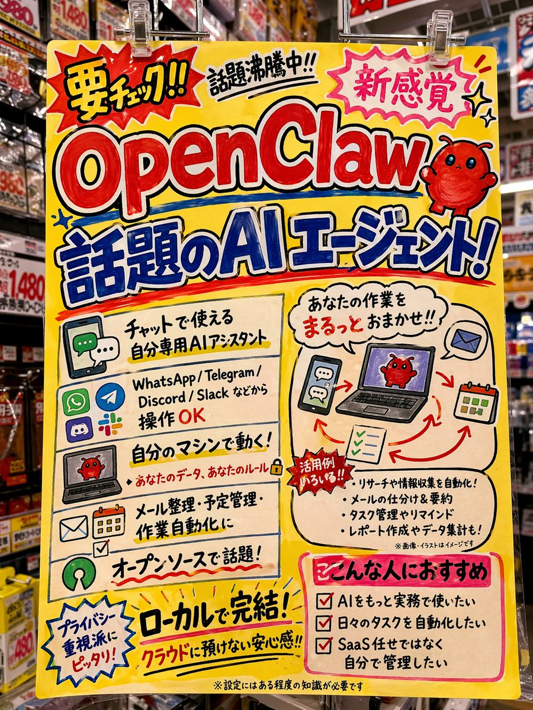

# Don Quijote Promo Pop Poster

## Source

- Section: UI & Social Media Mockup Cases
- Case: 34
- Author: [@loglogrog](https://x.com/loglogrog)
- Original case: [https://x.com/loglogrog/status/2046437230127034774](https://x.com/loglogrog/status/2046437230127034774)
- Source image folder: `ui_case34`

## Result



## Workflow Use

- Suggested handling: Mixed fit: UI, infographic, mockup, and screenshot generation. Add layout and text-density tags before queue export.
- Before queue export, add your own taxonomy tags such as `topCategory`, `subCategory`, `scene`, `appeal`, and `subject`.

## Prompt

```text
GPT Image 2を使って、OpenClawの情報を調べてドンキの広告ポップ風に実際のドンキに貼っているような感じで画像生成してください
```
